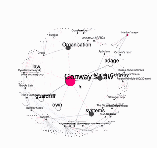

# Digital garden

Rendering of collection of markdown files into a web site with visualisations to
help navigation and discovery of related content.

Run the command `garden` in any local folder to spin up a local web server based
on your local files or deploy site to hosting environment like Vercel. See below
for details.

See <https://digital-garden-blush.vercel.app/> for a deployment of the
test-garden in this repository.

## Running locally

To try out locally `pnpm install` and then start up with

    pnpm build:prepare
    pnpm dev

To point to a local directory of markdown files by setting the
`GARDENS_DIRECTORY` environment variable in a `.env` file in the root of this
project and restarting the service. For example:

    GARDENS_DIRECTORY=../../../../my-garden

## Deploying with Vercel

Create a deployment from a Git repository that has Markdown content in. Set the
**framework preset** to **Other**. Set the **build command** to:

    cd digital-garden && pnpm build:prepare && pnpm build && pnpm export

Set the **output directory** to:

    digital-garden/packages/site/out

Set the **install command** to:

    git clone https://github.com/ianhomer/digital-garden && \
      cd digital-garden && pnpm install --filter !@garden/end-to-end

Then deploy and visit generated site.

## Environment configuration

Configure environment with variables defined in either via a `.env` in the
project root directory or as shell environment variables.

Define one or more gardens, by providing an environment variable starting with
`GARDEN_` defining a git URL to the Markdown content, for example:

    GARDEN_MY=https://github.com/name/garden.git

Scripts can be injected with the `SCRIPTS` environment variable. This can be
used to integrate site analytics, for example Plausible analytics

    SCRIPTS=[{"data-domain":"my-domain.com","src":"https://plausible.io/js/script.js"}]

## Local garden

Install the `garden` global command to render the garden from a given folder.

    cd packages/site
    pnpm link --global

And then in any directory with markdown files in run `garden`.

Create the directory `~/.local/garden/meta` if you wish the garden meta JSON
files to be stored in a central local location.

## Markdown and linking

An emphasis is made to display links between articles. This can be done
with explicit wiki style links, with `[[...]]` or via natural language
processing. The natural language processing discovers notes by the looking the
first paragraph in the document and finding either links that are not explicitly
tagged, or wanted notes that referenced by multiple notes. Links to plural
knowns that don't exist are automatically linked to singular version of noun if
article of that name does exist. The goal of this is to find useful and
related content, inferred from natural language. This can help find patterns we
did not expect and help guide decisions we may wish to make.

| line in graph     | meaning                       |
| ----------------- | ----------------------------- |
| solid grey        | explicit link                 |
| short dashed blue | back link                     |
| medium dashed red | natural link                  |
| long dashed red   | natural back link             |
| dotted lin        | child link (markdown) section |

| node in graph | meaning                                           |
| ------------- | ------------------------------------------------- |
| big           | current note                                      |
| medium        | first level depth                                 |
| small         | second level depth                                |
| white         | wanted note - referenced note that does not exist |
| red           | locked note                                       |

## Running tests

Unit tests

    pnpm test

e2e tests

    pnpm test:build
    pnpm test:e2e

if you need to re-install browsers for playwright

    cd packages/end-to-end
    pnpm exec playwright install
