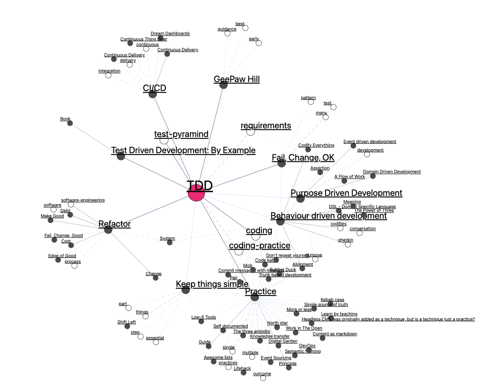

# Digital Garden

Rendering of a Zettelkasten collection of markdown content into a web site with
visualisations to help navigation and discovery of related content. See
<https://boxofjam.com> for an example.

## Running Locally

To try out locally `pnpm install` and then start up with

    pnpm build:prepare
    pnpm dev

To point to a local directory of markdown files by setting the
`GARDENS_DIRECTORY` environment variable in a `.env` file in the root of this
project and restarting the service. For example:

    GARDENS_DIRECTORY=../../../../things/boxofjam

## Deploying with Vercel

Fork this repository, sign up to an account with <https://vercel.com/>, create a
new project and import the repository you forked. Go to settings and change the
build command to:

    pnpm build:prepare && pnpm build

Change install command to

    pnpm install --filter !@garden/end-to-end

And add URL to your markdown content repository by adding a `GARDEN_`
environment variable , e.g.

    GARDEN_BOXOFJAM=https://github.com/purplepip/boxofjam.git

Then deploy and visit generated site.

## Environment Configuration

Configure environment with variables defined in either via a `.env` in the
project root directory or as shell environment variables.

Define one or more gardens, by providing an environment variable starting with
`GARDEN_` defining a git URL to the markdown content.

    GARDEN_MY=https://github.com/purplepip/boxofjam.git
